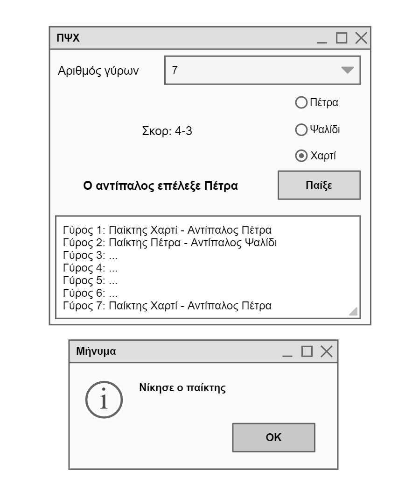

# Επιπλέον υλικό για τις εργασίες

## Εργασία 1

Mock interface για την εργασία 1 (σχεδιάστηκε με το [pencil project](https://pencil.evolus.vn/))

## Εργασία 2

* Διάσχιση υποκαταλόγων ενός καταλόγου με την os.walk
  * [os_walk.py](./../pl/python/os_walk.py) 

## Εργασία 3

* [Håkan Kjellerstrand - OR-Tools Page](http://www.hakank.org/google_or_tools)
  * [Sudoku](http://www.hakank.org/google_or_tools/sudoku_mip_sat.py)

