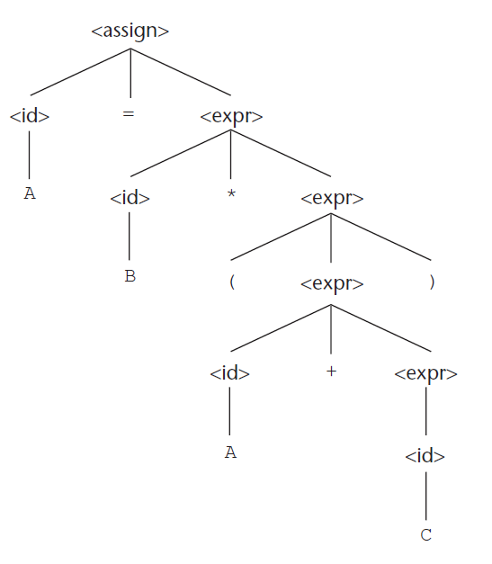
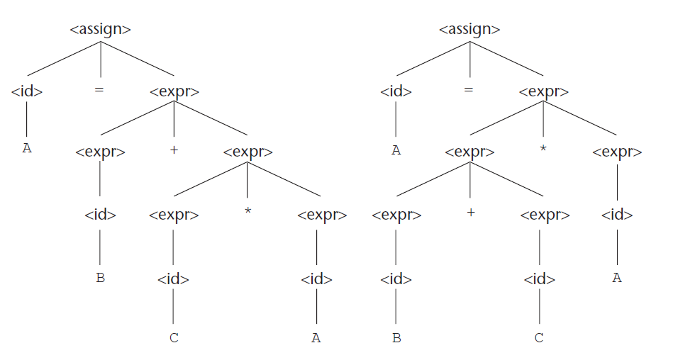
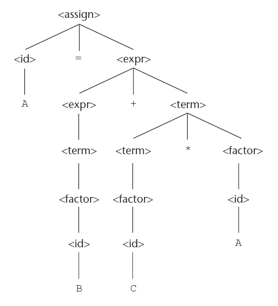
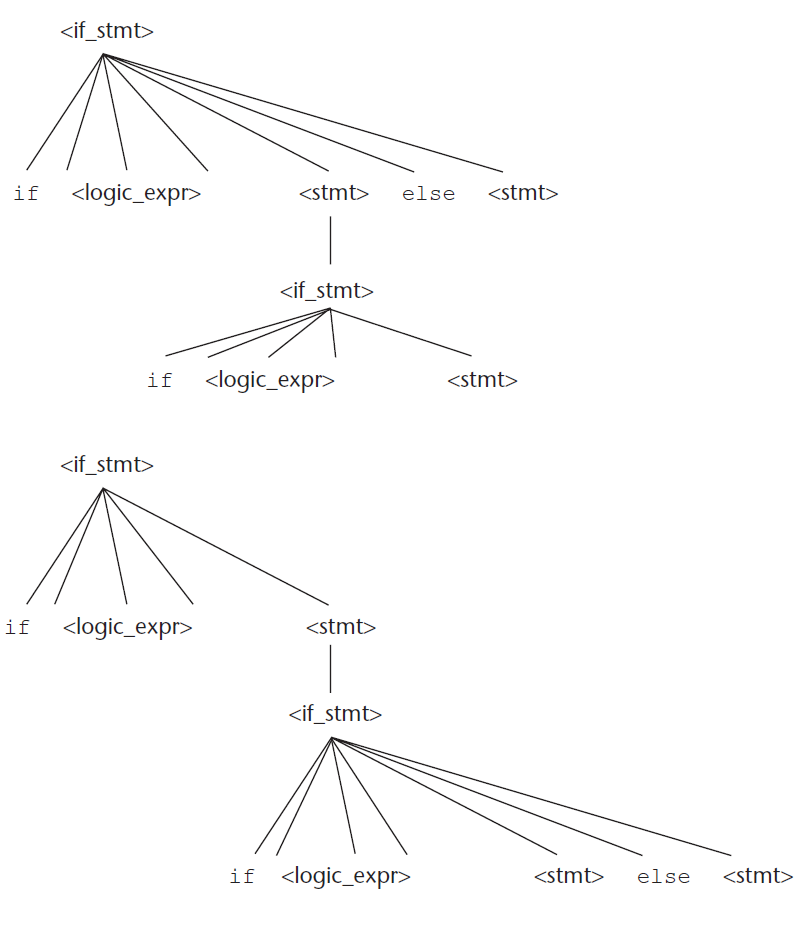
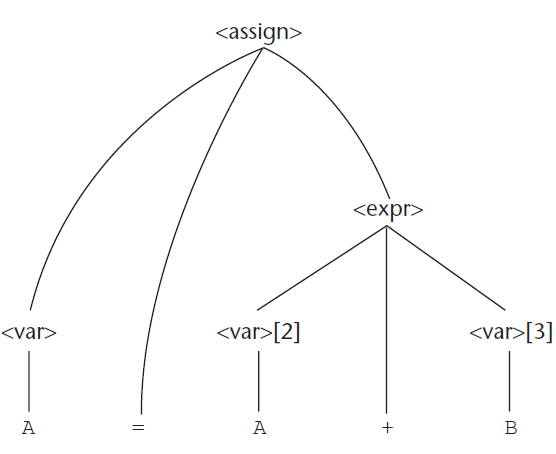
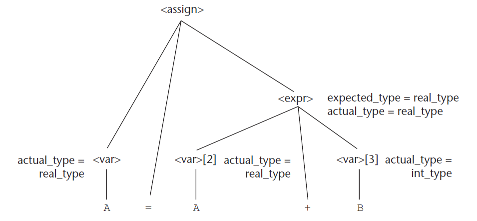

# 3. Περιγραφή συντακτικού και σημασιολογίας

* Συντακτικό
* Σημασιολογία
* Μέθοδος περιγραφής συντακτικού γραμματικών χωρίς συμφραζόμενα (CFGs)
* Παραγωγή, δένδρα συντακτικής ανάλυσης, ασάφεια, προτεραιότητα τελεστών, προσεταιριστικότητα τελεστών
* BNF, EBNF
* Γραμματικές χαρακτηριστικών (attribute grammars) για περιγραφή συντακτικού και στατικής σημασιολογίας
* Δυναμική σημασιολογία

## 3.1 Εισαγωγή

* Η πληρότητα και η ακρίβεια περιγραφής μιας γλώσσας προγραμματισμού είναι κεφαλαιώδους σημασίας.
* Ορισμένες γλώσσες παρουσιάζουν το πρόβλημα της ύπαρξης πολλών διαφορετικών διαλέκτων ως συνέπεια του όχι απόλυτα ακριβή ορισμού τους.
* Συντακτικό είναι η μορφή (δομή) των εκφράσεων, εντολών, και προγραμματιστικών μονάδων.
* Σημασιολογία είναι η σημασία των εκφράσεων, εντολών, και προγραμματιστικών μονάδων.
* Μια γλώσσα ορίζεται από το συντακτικό και της σημασιολογία της.
* Παράδειγμα: Ποια είναι η σημασιολογία του ακόλουθου κώδικα;
  
    ```
    while(λογική_έκφραση) εντολές
    ```

## 3.2 Το γενικό πρόβλημα της περιγραφής του συντακτικού

* Μια πρόταση είναι ένα σύνολο χαρακτήρων (συμβολοσειρές) κάποιου αλφαβήτου.
* Οι συντακτικοί κανόνες καθορίζουν τις έγκυρες προτάσεις που περιλαμβάνει η γλώσσα.
* Μια γλώσσα είναι το σύνολο των έγκυρων προτάσεών της.
* Οι κανόνες συντακτικού των φυσικών γλωσσών (π.χ. Ελληνικά) είναι πολύ πιο περίπλοκοι από τους κανόνες των τεχνητών γλωσσών (π.χ. Java).

### Λέξημα (lexeme)

* Ένα λέξημα είναι η συντακτική μονάδα χαμηλότερου επιπέδου της γλώσσας (π.χ., *, sum, begin). 
* Τα λεξήματα δεν περιλαμβάνονται στην περιγραφή του συντακτικού.
* Ένα πρόγραμμα μπορεί να θεωρηθεί ως μια ακολουθία λεξημάτων παρά ως μια ακολουθία χαρακτήρων.

### Λεκτική μονάδα (token)

* Μια λεκτική μονάδα  είναι μια κατηγορία λεξημάτων (π.χ. αναγνωριστικά μεταβλητών)
* Υπάρχουν λεκτικές μονάδες με ένα μόνο πιθανό λέξημα (π.χ. ο τελεστής +)

Παράδειγμα: Ποια είναι τα λεξήματα και ποιες οι λεκτικές μονάδες για τον ακόλουθο κώδικα;

```
index = 2 * count + 17;
```

| Λέξημα | Λεκτική μονάδα           |
| ------ | ------------------------ |
| index  | αναγνωριστικό            |
| =      | σύμβολο_ίσον             |
| 2      | ακέραια_τιμή             |
| *      | τελεστής πολλαπλασιασμού |
| count  | αναγνωριστικό            |
| +      | τελεστής πρόσθεσης       |
| 17     | ακέραια_τιμή             |
| ;      | ερωτηματικό              |


### 3.2.1 Μηχανισμοί αναγνώρισης γλωσσών (recognizers)

Οι recognizers διαβάζουν από την είσοδο συμβολοσειρές του αλφαβήτου της γλώσσας και αποφασίζουν το εάν  ανήκουν ή όχι στη γλώσσα. Παράδειγμα μηχανισμού αναγνώρισης γλωσσών είναι ο συντακτικός αναλυτής των μεταγλωττιστών.

### 3.2.2 Μηχανισμοί παραγωγής γλωσσών (generators)

Οι generators παράγουν έγκυρες προτάσεις της γλώσσας. Μπορεί να εξεταστεί αν η σύνταξη μιας συγκεκριμένης πρότασης είναι ορθή πραγματοποιώντας σύγκριση με τη δομή του μηχανισμού παραγωγής.

## 3.3 Επίσημες μέθοδοι περιγραφής συντακτικού

### 3.3.1 Μορφή Μπάκους-Νάουρ και γραμματικές χωρίς συμφραζόμενα

H BNF (Backus Naur Form) και οι CFG (Context Free Grammars) είναι ισοδύναμοι τρόποι περιγραφής του συντακτικού μιας γλώσσας.

#### 3.3.1.1 Γραμματικές χωρίς συμφραζόμενα

* Αναπτύχθηκαν από τον Noam Chomsky στα μέσα των 1950s.
* Είχαν ως στόχο την περιγραφή του συντακτικού των φυσικών γλωσσών.
* Ορίζουν μια κατηγορία γλωσσών που ονομάζονται γλώσσες χωρίς συμφραζόμενα.

#### 3.3.1.2 Προέλευση της μορφής Μπάκους-Νάουρ

* Προτάθηκαν από τον John Backus για να περιγράψουν το συντακτικό της Algol 58.
* Τροποποιήθηκαν από τον Peter Naur για την περιγραφή της Algol 60.
* Η BNF είναι ένας φυσικός συμβολισμός για την περιγραφή συντακτικού.
* Η BNF είναι ισοδύναμη με τις CFGs.

#### 3.3.1.3 Βασικές έννοιες BNF

* H BNF είναι μια μετα-γλώσσα για περιγραφή συντακτικού γλωσσών προγραμματισμού.
* Μη-τερματικά (non-terminals): αφαιρέσεις που αναπαριστούν κατηγορίες συντακτικών δομών.
* Τα μη τερματικά εσωκλείονται σε <>
* Τερματικά (terminals): λεξήματα ή λεκτικές μονάδες.
* Σύμβολο έναρξης: ένα από τα μη-τερματικά σύμβολα.
* Κανόνες BNF: αποτελούνται από αριστερό μέρος που είναι κάποιο μη-τερματικό και από δεξιό μέρος που είναι μια συμβολοσειρά από τερματικά και/ή μη-τερματικά.
* Με τη BNF περιγράφονται:
  * Λίστες παρόμοιων δομών.
  * Η σειρά με την οποία πρέπει να εμφανίζονται διαφορετικές δομές και ένθετες δομές σε οποιοδήποτε βάθος.
  * Προτεραιότητα τελεστών.
  * Προσεταιριστικότητα τελεστών.

Παράδειγμα ορισμού της εκχώρησης ως BNF (σε μια υποθετική γλώσσα προγραμματισμού):

    <assign> -> <var> = <expression>

Παράδειγμα πρότασης που περιγράφεται από τον παραπάνω κανόνα:

    total = subtotal1 + subtotal2

Παράδειγμα κανόνων BNF με δύο RHS

    <if_stmt> -> if (<logic_expr>) <stmt>
               | if (<logic_expr>) <stmt> else <stmt>
    <stmt> -> <single_stmt>
            | begin <stmt_list> end

#### 3.3.1.4 Περιγραφή λιστών

Ο ορισμός λιστών μεταβλητού μήκους γίνεται στην BNF με αναδρομή (το μη-τερματικό στο LHS εμφανίζεται ξανά στο RHS)

    <identifier_list> -> identifier
                       | identifier, <identifier_list>
    
#### 3.3.1.5 Γραμματικές και παραγωγές

* Μια γραμματική είναι μια παραγωγική συσκευή για τον ορισμό γλωσσών.
* Μια παραγωγή (derivation) είναι η επαναλαμβανόμενη εφαρμογή κανόνων, ξεκινώντας από το αρχικό σύμβολο και τερματίζοντας σε μια πρόταση που περιέχει μόνο τερματικά σύμβολα.

Ένα παράδειγμα γραμματικής 

    <program> -> <stmts>
    <stmts> -> <stmt> 
             | <stmt> ; <stmts>
    <stmt> -> <var> = <expr>
    <var> -> a | b | c | d
    <expr> -> <term> + <term> 
            | <term> - <term>
    <term> -> <var> | const

Παραγωγή της πρότασης a = b + const (χρησιμοποιώντας αριστερότερες παραγωγές)

    <program>   => <stmts>              <-- sentential form
                => <stmt>               <-- sentential form
                => <var> = <expr>       <-- sentential form
                => a = <expr>           <-- sentential form
                => a = <term> + <term>  <-- sentential form
                => a = <var> + <term>   <-- sentential form
                => a = b + <term>       <-- sentential form
                => a = b + const        <-- sentence (μόνο τερματικά σύμβολα)

Ένα ακόμα παράδειγμα γραμματικής (για απλές προτάσεις εκχώρησης)

    <assign> -> <id> = <expr>
    <id>     -> A | B | C
    <expr>   -> <id> + <expr>
              | <id> * <expr>
              | ( <expr> )
              | <id>

Παραγωγής της πρότασης A = B * (A + C)

    <assign>    => <id> = <expr>
                => A = <expr>
                => A = <id> * <expr>
                => A = B * <expr>
                => A = B * ( <expr>)
                => A = B * ( <id> + <expr>)
                => A = B * ( A + <expr>)
                => A = B * ( A + <id>)
                => A = B * ( A + C )

#### 3.3.1.6 Δένδρα συντακτικής ανάλυσης

* Τα δένδρα συντακτικής ανάλυσης (parse trees) αποτελούν ιεραρχικές αναπαραστάσεις παραγωγών.
* Κάθε εσωτερικός κόμβος ενός parse tree σημειώνεται με ένα μη-τερματικό σύμβολο και κάθε φύλλο με ένα τερματικό σύμβολο.

Παράδειγμα: Το parse tree για την πρόταση A = B * (A + C)



#### 3.3.1.7 Ασάφεια

Μια γραμματική που παράγει μια προτασιακή μορφή για την οποία υπάρχουν δύο ή περισσότερα διακριτά δένδρα συντακτικής ανάλυσης λέμε ότι είναι ασαφής (ambiquous).


Παράδειγμα ασαφούς γραμματικής 

    <assign> -> <id> = <expr>
    <id> -> A | B | C
    <expr> -> <expr> + <expr>
            | <expr> * <expr>
            | ( <expr>)
            | <id>

Για την πρόταση 

    A = B + C * A

προκύπτουν δύο διαφορετικά δένδρα συντακτικής ανάλυσης:



#### 3.3.1.8 Προτεραιότητα τελεστών

Αν ένας τελεστής σε μια αριθμητική έκφραση παράγεται χαμηλότερα στο δένδρο συντακτικής ανάλυσης (και συνεπώς πρέπει να αποτιμηθεί πρώτος) τότε έχει προτεραιότητα ως προς τελεστές που παράγονται υψηλότερα στο δένδρο.

Παράδειγμα σαφούς γραμματικής 

    <assign> -> <id> = <expr>
    <id> -> A | B | C
    <expr> -> <expr> + <term>
            | <term>
    <term> -> <term> * <factor>
            | <factor>
    <factor> -> ( <expr> )
              | <id>

Παραγωγή της πρότασης A = B + C * A (αριστερότερες παραγωγές)

    <assign>    => <id> = <expr>
                => A = <expr>
                => A = <expr> + <term>
                => A = <term> + <term>
                => A = <factor> + <term>
                => A = <id> + <term>
                => A = B + <term>
                => A = B + <term> * <factor>
                => A = B + <factor> * <factor>
                => A = B + <id> * <factor>
                => A = B + C * <factor>
                => A = B + C * <id>
                => A = B + C * A

Παραγωγή της πρότασης A = B + C * A (με δεξιότερες παραγωγές)

    <assign>    => <id> = <expr>
                => <id> = <expr> + <term>
                => <id> = <expr> + <term> * <factor>
                => <id> = <expr> + <term> * <id>
                => <id> = <expr> + <term> * A
                => <id> = <expr> + <factor> * A
                => <id> = <expr> + <id> * A
                => <id> = <expr> + C * A
                => <id> = <term> + C * A
                => <id> = <factor> + C * A
                => <id> = <id> + C * A
                => <id> = B + C * A
                => A = B + C * A

Το δένδρο συντακτικής ανάλυσης που προκύπτει (και για τις δύο περιπτώσεις).



Κάθε παραγωγή με σαφή γραμματική έχει ένα και μοναδικό δένδρο συντακτικής ανάλυσης. Ωστόσο το ίδιο δένδρο συντακτικής ανάλυσης μπορεί να προκύψει από διαφορετικές παραγωγές μιας σαφούς γραμματικής.

#### 3.3.1.9 Προσεταιριστικότητα τελεστών

Όταν μια έκφραση περιλαμβάνει δύο τελεστές που έχουν την ίδια προτεραιότητα (π.χ. * και /) τότε απαιτείται ένας σημασιολογικός κανόνας προκειμένου να καθοριστεί ποιος τελεστής θα πρέπει να έχει προτεραιότητα (π.χ. A / B * C). O κανόνας αυτός ονομάζεται **προσεταιριστικότητα**.

* Αριστερή προσεταιριστικότητα: +, -, *, /
  * 1 + 2 + 3 => 3 + 3 => 6
* Δεξιά προσεταιριστικότητα: ^ (ύψωση σε δύναμη)
  * 2^2^3 => 2^8 => 256

Η προσεταιριστικότητα τελεστών μπορεί να καθορίζεται μέσω της γραμματικής.

Η ακόλουθη γραμματική είναι ασαφής  

    <expr> -> <expr> + <expr> 
            | <id>

Η ακόλουθη γραμματική είναι σαφής  (ορίζει αριστερή προσεταιριστικότητα).

    <expr> -> <expr> + <id> 
            | <id>

Παρατηρήστε ότι ο κανόνας είναι αριστερά αναδρομικός.

Η ακόλουθη γραμματική είναι σαφής (ορίζει δεξιά προσεταιριστικότητα).

    <factor> -> <exp> ^ <factor>
              | <exp>
    <exp> -> ( <expr> )
           | id

Παρατηρήστε ότι ο 1ος κανόνας είναι δεξιά αναδρομικός.

#### 3.3.1.10 Μια ασαφής γραμματική για το if-else

Γραμματική (ασαφής)

    <if_stmt> ->    if (<logic_expr>) <stmt>
                    if (<logic_expr>) <stmt> else <stmt>
    <stmt> -> <if_stmt> 

Πρόταση

    if (<logic_expr>) if (<logic_expr>) <stmt> else <stmt>


Δένδρα συντακτικής ανάλυσης (δύο λόγω ασαφούς γραμματικής)



Γραμματική (σαφής)

    <stmt> -> <matched> | <unmatched>
    <matched>   -> if (<logic_expr>) <matched> else <matched>
                | any non-if statement
    <unmatched> -> if (<logic_expr>) <stmt>
                | if (<logic_expr>) <matched> else <unmatched>

Για την πρόταση

    if (<logic_expr>) if (<logic_expr>) <stmt> else <stmt>

υπάρχει ένα μόνο δένδρο συντακτικής ανάλυσης για την παραπάνω πρόταση

### 3.3.2 Εκτεταμένη BNF (Extended BNF)

Η εκτεταμένη BNF δεν ενισχύει την περιγραφική δύναμη της BNF, απλά αυξάνει την ευκολία ανάγνωσης και γραφής του.Τρεις επεκτάσεις:

1. Προαιρετικά τμήματα του RHS τοποθετούνται σε αγκύλες []

Αντί για:

    <if_stmt> -> if (<expression>) <statement>
               | if (<expression>) <statement> else <statement>

σε EBNF γράφουμε:

    <if_stmt> → if (<expression>) <statement> [else <statement>]

2. Χρήση αγκυλών {} υποδηλώνουν ότι το τμήμα που εσωκλείεται μπορεί να επαναλαμβάνεται απεριόριστα ή να αποκλειστεί εντελώς

Αντί για:

    <identifier_list> -> identifier
                       | identifier, <identifier_list>

σε EBNF γράφουμε:

    <identifier_list> -> identifier {, identifier}


3. Χρήση παρενθέσεων και τελεστή | για να υποδηλώσει δυνατότητα επιλογής ενός στοιχείου από μια ομάδα στοιχείων

Αντί για:

    <term> -> <term> * <factor>
            | <term> / <factor>
            | <term> % <factor>

σε EBNF γράφουμε:

    <term> -> <term> (* | / | %) <factor>


Παράδειγμα γραμματικής σε BNF και ισοδύναμης σε EBNF

BNF

    <expr> -> <expr> + <term>
            | <expr> - <term>
            | <term>
    <term> -> <term> * <factor>
            | <term> / <factor>
            | <factor>
    <factor> -> <exp> ^ <factor>
              | <exp>
    <exp> -> (<expr>)
           | id

EBNF (ισοδύναμο με το παραπάνω σε BNF)

    <expr> -> <term> {(+ | -) <term>}
    <term> -> <factor> {(* | /) <factor>}
    <factor> -> <exp> { ^ <exp>}
    <exp> -> (<expr>) | id

Επιπλέον παραλλαγές στην EBNF

* Εναλλακτικά RHS τοποθετούνται σε ξεχωριστές γραμμές αντί για \|
* Χρήση : αντί για ->
* Χρήση opt για προαιρετικά μέρη, αντί για αγκύλες [ ]
* Χρήση oneof για επιλογές αντί για παρενθέσεις και \|

### 3.3.3 Γραμματικές και recognizers

Μπορεί να κατασκευαστεί αλγοριθμικά ένα αναγνωριστικό για μια γλώσσα χωρίς συμφραζόμενα, δεδομένης της γραμματικής της. Συνεπώς, η κατασκευή του συντακτικού αναλυτή για μια νέα γλώσσα μπορεί να αυτοματοποιηθεί με εργαλεία λογισμικού όπως το yacc, το bison κ.α.

## 3.4 Γραμματικές χαρακτηριστικών (ή κατηγορικές γραμματικές)

Μια γραμματική χαρακτηριστικών (attribute grammar) είναι μια γραμματική που επιτυγχάνει να να περιγράψει τη δομή μιας γλώσσας προγραμματισμού καλύτερα από μια γραμματική χωρίς συμφραζόμενα.

### 3.4.1 Στατική σημασιολογία

Κανόνες στατικής σημασιολογίας: πρόκειται για κανόνες του συντακτικού των γλωσσών προγραμματισμού που μπορούν να ελεγχθούν κατά τη μεταγλώττιση και οι οποίοι είτε δεν μπορούν να οριστούν με γραμματικές χωρίς συμφραζόμενα είτε ορίζονται μεν αλλά με δύσχρηστο τρόπο. 

### 3.4.2 Βασικές έννοιες

Οι γραμματικές χαρακτηριστικών είναι γραμματικές χωρίς συμφραζόμενα στις οποίες έχουν προστεθεί:
1. χαρακτηριστικά: σχετίζονται με τερματικά και μη-τερματικά σύμβολα και είναι παρόμοια με μεταβλητές καθώς δέχονται τιμές
2. συναρτήσεις υπολογισμού χαρακτηριστικών: καθορίζουν τον τρόπο υπολογισμού των χαρακτηριστικών
3. κατηγορήματα: εκφράζουν τους σημασιολογικούς κανόνες γραμματικής της γλώσσας

### 3.4.3 Ορισμός γραμματικών χαρακτηριστικών

Μια γραμματική χαρακτηριστικών είναι μια γραμματική χωρίς συμφραζόμενα όπου:
1. Για κάθε σύμβολο γραμματικής υπάρχει ένα σύνολο τιμών χαρακτηριστικών Α(Χ).
2. Για κάθε κανόνα γραμματικής υπάρχει ένα σύνολο συναρτήσεων που ορίζουν χαρακτηριστικά μη-τερματικών του κανόνα
3. Για κάθε κανόνα υπάρχει ένα σύνολο κατηγορημάτων που πρέπει να ελέγχονται για να διασφαλιστεί η συνέπεια των χαρακτηριστικών

Έστω ένας κανόνας:

    Χ0 -> Χ1 ... Χn

Τα λεγόμενα συντιθέμενα χαρακτηριστικά (synthesized attributes) ορίζονται από συναρτήσεις της μορφής:

    S(X0) = f(A(X1), ..., A(Xn))

Τα λεγόμενα κληρονομούμενα χαρακτηριστικά (inherited attributes) ορίζονται από συναρτήσεις της μορφής:

    I(Xj) = f(A(X0), ..., A(Xn)) για i <= j <= n

Τα συντιθέμενα χαρακτηριστικά μεταδίδουν σημασιολογικές πληροφορίες με ανοδική πορεία σε ένα δένδρο σημασιολογικής ανάλυσης. Τα κληρονομούμενα χαρακτηριστικά μεταδίδουν σημασιολογικές πληροφορίες με καθοδική και πλευρική πορεία σε ένα δένδρο σημασιολογικής ανάλυσης. 

Αν έχουν υπολογιστεί όλες οι τιμές χαρακτηριστικών σε ένα δένδρο συντακτικής ανάλυσης τότε το δένδρο λέγεται ότι είναι πλήρως χαρακτηρισμένο.

### 3.4.4 Εσωτερικά χαρακτηριστικά (intrinsic attributes)

Τα εσωτερικά χαρακτηριστικά είναι συντιθέμενα χαρακτηριστικά οι τιμές των οποίων ορίζονται εκτός του δένδρου συντακτικής ανάλυσης και αποδίδονται στα φύλλα του δένδρου. 

### 3.4.5 Παραδείγματα γραμματικών χαρακτηριστικών

Έστω το ακόλουθο συντακτικό μιας γλώσσας

    <assign> -> <var> = <expr>
    <expr> -> <var> + <var>
            | <var>
    <var> -> A | B | C

Η στατική σημασιολογία ορίζει ότι οι μεταβλητές είναι δύο τύπων int και real. Όταν υπάρχουν δύο μεταβλητές στη δεξιά πλευρά μιας εκχώρησης, οι μεταβλητές δεν είναι απαραίτητο να είναι του ίδιου τύπου. Ειδικότερα ισχύει ότι:
  * όταν οι τύποι των δύο μεταβλητών δεν είναι ίδιοι, τότε ο τύπος της έκφρασης είναι πραγματικός.
  * όταν οι τύποι των δύο μεταβλητών είναι ίδιοι, τότε ο τύπος της έκφρασης είναι ίδιος με αυτό τον τύπο.

Τα χαρακτηριστικά των μη-τερματικών συμβόλων είναι:
* actual_type: Συντιθέμενο χαρακτηριστικό που σχετίζεται με τα μη-τερματικά \<var>
και \<expr>. Χρησιμοποιείται για την αποθήκευση του πραγματικού τύπου, int ή real, μιας μεταβλητής ή μιας έκφρασης. Αν πρόκειται για μεταβλητή, ο πραγματικός τύπος είναι εσωτερικό χαρακτηριστικό (intrinsic attribute). Αν πρόκειται για έκφραση, καθορίζεται από τους πραγματικούς τύπους των παιδιών του μη τερματικού \<expr>.
* expected_type: Κληρονομούμενο χαρακτηριστικό που σχετίζεται με το μη-τερματικό \<expr>. Χρησιμοποιείται για να αποθηκεύσει τον τύπο,  int ή real, που αναμένεται για την έκφραση, όπως καθορίζεται από τον τύπο της μεταβλητής στο αριστερό μέρος της εντολής ανάθεσης.

Η γραμματική χαρακτηριστικών στο σύνολο της είναι η ακόλουθη:

    1. Συντακτικός κανόνας: <assign> -> <var> = <expr>
       Σημασιολογικός κανόνας: <expr>.expected_type <- <var>.actual_type

    2. Συντακτικός κανόνας: <expr> -> <var>[2] + <var>[3]
       Σημασιολογικός κανόνας: <expr>.actual_type <-
        if (<var>[2].actual_type = int) and (<var>[3].actual_type = int) then 
            int
        else 
            real
        end if
       Κατηγόρημα: <expr>.actual_type == <expr>.expected_type

    3. Συντακτικός κανόνας: <expr> -> <var>
       Σημασιολογικός κανόνας: <expr>.actual_type <- <var>.actual_type
       Κατηγόρημα: <expr>.actual_type == <expr>.expected_type

    4. Συντακτικός κανόνας: <var> -> A | B | C
       Σημασιολογικός κανόνας: <var>.actual_type <- look-up(<var>.string)

Η συνάρτηση look-up ελέγχει αν υπάρχει ένα όνομα μεταβλητής στον πίνακα συμβόλων και επιστρέφει τον τύπο της μεταβλητής

Το δένδρο συντακτικής ανάλυσης για την πρόταση:

    A = A + B

είναι το ακόλουθο




Με την ακόλουθη σειρά αποτίμησης είναι δυνατός ο υπολογισμός των χαρακτηριστικών

    1. <var>.actual_type <- look-up(A) (κανόνας 4)
    2. <expr>.expected_type <- <var>.actual_type (κανόνας 1)
    3. <var>[2].actual_type <- look-up(A) (κανόνας 4)
       <var>[3].actual_type <- look-up(B) (κανόνας 4)
    4. <expr>.actual_type <- είτε int είτε real (κανόνας 2)
    5. <expr>.expected_type == <expr>.actual_type που είναι είτε TRUE είτε FALSE

Αν το Α είναι real και το B είναι int τότε προκύπτει το ακόλουθο επισημειωμένο δένδρο συντακτικής ανάλυσης



## 3.5 Περιγραφή του νοήματος των προγραμμάτων: Δυναμική σημασιολογία

Δεν υπάρχει ένας κοινά αποδεκτός συμβολισμός ή φορμαλισμός για την περιγραφή της σημασιολογίας των γλωσσών προγραμματισμού. Οι 3 κύριοι τρόποι περιγραφής της σημασιολογίας είναι οι:

* Λειτουργική σημασιολογία
* Δηλωτική σημασιολογία
* Αξιωματική σημασιολογία

Η μεθοδολογίες και οι συμβολισμοί για τη σημασιολογία επιτρέπουν (σε κάποιο βαθμό):

* την πληρέστερη περιγραφή των δομών της γλώσσας
* την κατασκευή μηχανισμών απόδειξης ορθότητας προγραμμάτων
* την κατασκευή γεννητριών μεταγλωττιστών
* την ανίχνευση ασαφειών και ασυνεπειών στην κατασκευή των γλωσσών προγραμματισμού

<!-- ### 3.5.1 Λειτουργική σημασιολογία

### 3.5.2 Δηλωτική σημασιολογία

### 3.5.3 Αξιωματική σημασιολογία -->
