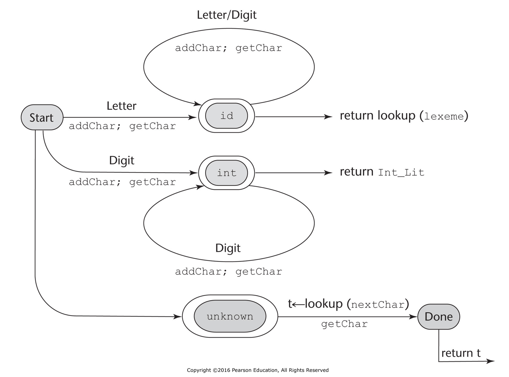

# 4. Λεκτική και συντακτική ανάλυση

* Λεκτικός αναλυτής 
* Συντακτικός αναλυτής
* Συντακτική ανάλυση
  * Συντακτική ανάλυση από πάνω προς τα κάτω (αναδρομική κατάβαση)
  * Συντακτική ανάλυση από κάτω προς τα πάνω (συντακτική ανάλυση LR)

## 4.1 Εισαγωγή

* Ο συντακτικός αναλυτής είναι βασικό τμήμα του μεταγλωττιστή καθώς άλλα τμήματα του μεταγλωττιστή όπως ο σημασιολογικός αναλυτής και η γεννήτρια κώδικα καθοδηγούνται από τις ενέργειες του συντακτικού αναλυτή.
* Συνηθισμένος τρόπος περιγραφής του συντακτικού μιας γλώσσας είναι οι γραμματικές χωρίς συμφραζόμενα (CFG). Η περιγραφή του συντακτικού συνήθως γίνεται κάνοντας χρήση του συμβολισμού BNF.
* Η πλειονότητα των μεταγλωττιστών χωρίζουν το έργο της συντακτικής ανάλυσης σε δύο διακριτά μέρη, τη **λεκτική ανάλυση** και την καθ' αυτό **συντακτική ανάλυση**.  Οι λόγοι για το διαχωρισμό της λεκτικής ανάλυσης από τη συντακτική ανάλυση είναι:
  * Απλότητα - Οι τεχνικές λεκτικής ανάλυσης είναι απλούστερες από τις τεχνικές συντακτικής ανάλυσης.
  * Αποδοτικότητα - Βελτιστοποιήσεις μπορούν να γίνουν ξεχωριστά είτε στο λεκτικό αναλυτή είτε στο συντακτικό αναλυτή.
  * Μεταφερσιμότητα - Ο λεκτικός αναλυτής μπορεί να εξαρτάται από την πλατφόρμα εκτέλεσης (ανάγνωση αρχείων, προσωρινή αποθήκευση εισόδου) αφήνοντας το συντακτικό αναλυτή ανεξάρτητο πλατφόρμας.

## 4.2 Λεκτική ανάλυση

* Ο λεκτικός αναλυτής αποτελεί μέρος της συντακτικής ανάλυσης.
* Ο λεκτικός αναλυτής ουσιαστικά είναι ένας μηχανισμός αντιστοίχισης μοτίβων. Εντοπίζει συμβολοσειρές στο πηγαίο κώδικα που ονομάζονται λεξήματα (lexems) και τις αντιστοιχεί σε κατηγορίες που ονομάζονται λεκτικές μονάδες (tokens). Για παράδειγμα:

    ```
    result = oldsum - value / 100;
    ```

    | Λεκτική μονάδα | Λέξημα |
    | -------------- | ------ |
    | IDENTIFIER     | result |
    | ASSIGN_OP      | =      |
    | IDENTIFIER     | oldsum |
    | SUB_OP         | -      |
    | IDENTIFIER     | value  |
    | DIV_OP         | /      |
    | INT_LITERAL    | 100    |
    | SEMICOLON      | ;      |

* Οι περισσότεροι λεκτικοί αναλυτές είναι υποπρογράμματα που καλούνται από το συντακτικό αναλυτή, εντοπίζουν το επόμενο λέξημα στην είσοδο και επιστρέφουν το λέξημα και τη λεκτική μονάδα στην οποία ανήκει.
* Ο λεκτικός αναλυτής εντοπίζει ενδεχόμενα σφάλματα σε λεξήματα (π.χ. λάθος μορφοποίηση τιμής κινητής υποδιαστολής).

Υπάρχουν 3 βασικές προσεγγίσεις για τη κατασκευή ενός λεκτικού αναλυτή:

1. Χρησιμοποιώντας το [flex](https://github.com/westes/flex) ή παρόμοιο παράγουμε αυτόματα έναν λεκτικό αναλυτή, δίνοντας ως είσοδο κανονικές εκφράσεις που περιγράφουν τις λεκτικές μονάδες της γλώσσας.
2. Σχεδιάζουμε ένα διάγραμμα καταστάσεων που περιγράφει τα μοτίβα λεκτικών μονάδων της γλώσσας και γράφουμε ένα πρόγραμμα που υλοποιεί το διάγραμμα.
3. Σχεδιάζουμε ένα διάγραμμα καταστάσεων που περιγράφει τα μοτίβα λεκτικών μονάδων της γλώσσας και γράφουμε ένα πρόγραμμα που υλοποιεί το διάγραμμα και το οποίο βασίζεται σε πίνακα.

**Διάγραμμα καταστάσεων** 

Διάγραμμα καταστάσεων είναι ένας κατευθυνόμενος γράφος. Οι κόμβοι του αποτελούν τις καταστάσεις και οι μεταβάσεις από κατάσταση σε κατάσταση προκαλούνται ανάλογα με το σύμβολο που τοποθετείται στο αντίστοιχο τόξο μετάβασης. Κάθε μετάβαση μπορεί να περιλαμβάνει ενέργειες που πρέπει να εκτελέσει ο λεκτικός αναλυτής όταν γίνεται η μετάβαση. Ένας κόμβος αποτελεί την αρχική κατάσταση και ένας οι περισσότεροι κόμβοι (που σημειώνονται με διπλές γραμμές) αποτελούν τις τελικές καταστάσεις.

Τα διαγράμματα καταστάσεων που χρησιμοποιούν οι λεκτικοί αναλυτές αναπαριστούν μια συγκεκριμένη κατηγορία υπολογιστικών μηχανών που ονομάζονται **πεπερασμένα αυτόματα**. Τα πεπερασμένα αυτόματα μπορούν να αναγνωρίζουν τα μέλη μιας κατηγορίας γλωσσών που ονομάζονται **κανονικές γλώσσες**.

### Παράδειγμα λεκτικού αναλυτή

Λεκτικός αναλυτής που αναγνωρίζει απλές αριθμητικές εκφράσεις που περιέχουν ονόματα μεταβλητών και ακέραιες τιμές ως τελεστέους. Τα ονόματα των μεταβλητών αποτελούνται πρέπει να ξεκινούν με γράμμα και μπορούν να ακολουθούν γράμματα και ψηφία.





#### Υλοποίηση σε C

* [front.c](./../../pl/c/lexical_analyzer/front.c)

Η έκφραση, π.χ. (sum + 47) / total, βρίσκεται σε αρχείο [front.in](./../../pl/c/lexical_analyzer/front.in) και διαβάζεται από το εκτελέσιμο.

```
$ gcc front.c -o front
$ ./front 
Next token is: 25, Next lexeme is (
Next token is: 11, Next lexeme is sum
Next token is: 21, Next lexeme is +
Next token is: 10, Next lexeme is 47
Next token is: 26, Next lexeme is )
Next token is: 24, Next lexeme is /
Next token is: 11, Next lexeme is total
Next token is: -1, Next lexeme is EOF
```

#### Υλοποίηση σε Python

* [Λεκτικός αναλυτής](./../../pl/python/lexical_analyzer/index.md)

<!-- #### Υλοποίηση με το flex -->

<!-- #### Υλοποίηση με το PLY -->

## 4.3 Το πρόβλημα της συντακτικής ανάλυσης

* Οι δύο βασικές κατηγορίες αλγορίθμων συντακτικής ανάλυσης είναι η συντακτική ανάλυση από πάνω προς τα κάτω και η συντακτική ανάλυση από κάτω προς τα πάνω.
* Θα εξεταστεί η πολυπλοκότητα της συντακτικής ανάλυσης.

### 4.3.1 Εισαγωγή στη συντακτική ανάλυση

Οι συντακτικοί αναλυτές κατασκευάζουν (πιθανά έμμεσα) δένδρα συντακτικής ανάλυσης (parse trees). Έμμεση κατασκευή σημαίνει ότι παράγονται μόνο οι διασχίσεις του δένδρου που χρειάζονται. Οι στόχοι της συντακτικής ανάλυσης είναι:
1. Έλεγχος συντακτικής ορθότητας, εμφάνιση μεγαλύτερου δυνατού αριθμού διαγνωστικών μηνυμάτων για σφάλματα που υπάρχουν στον κώδικα.
2. Παραγωγή δένδρου συντακτικής ανάλυσης που χρησιμοποιείται ως βάση για μετάφραση.

#### Συμβάσεις συμβολισμών

* Τερματικά σύμβολα: πεζά γράμματα στην αρχή του Αγγλικού αλφαβήτου
* Μη τερματικά σύμβολα: κεφαλαία γράμματα στην αρχή του Αγγλικού αλφαβήτου
* Μεικτές συμβολοσειρές: πεζά γράμματα του Ελληνικού αλφαβήτου

### 4.3.2 Από πάνω προς τα κάτω συντακτικοί αναλυτές

Ένας συντακτικός αναλυτής από πάνω προς τα κάτω κατασκευάζει το δένδρο συντακτικής ανάλυσης προδιατεταγμένα (preorder), δηλαδή ξεκινώντας από τη ρίζα του δένδρου επισκέπτεται πρώτα τον κάθε κόμβο, μετά το αριστερό υποδένδρο του και μετά το δεξιό υποδένδρο του (αντιστοιχεί σε αριστερότερη παραγωγή).

Αν σε μια προτασιακή μορφή 

```
xAα
```

όπου το x είναι μια συμβολοσειρά με τερματικά σύμβολα, Α είναι ένα μη-τερματικό και α είναι μια συμβολοσειρά από τερματικά και μη τερματικά, το πρόβλημα της συντακτικής ανάλυσης από πάνω προς τα κάτω έχει να κάνει με τη σωστή επιλογή του κανόνα παραγωγής που θα έχει ως LHS το A.

Οι αλγόριθμοι που το επιτυγχάνουν (αλγόριθμος αναδρομικής κατάβασης και αλγόριθμος πίνακα LL) ονομάζονται αλγόριθμοι LL, όπου το πρώτο L αναφέρεται στη σάρωση της εισόδου από αριστερά προς τα δεξιά και το δεύτερο L αναφέρεται στην εφαρμογή αριστερότερης παραγωγής.


### 4.3.2 Από κάτω προς τα πάνω συντακτικοί αναλυτές

Ένας συντακτικός αναλυτής από κάτω προς τα πάνω κατασκευάζει το δένδρο συντακτικής ανάλυσης από τα φύλλα προς τη ρίζα. Αυτή η σειρά ανάλυσης αντιστοιχεί στο αντίστροφο μιας δεξιότερης παραγωγής καθώς οι προτασιακές μορφές παράγονται από το τέλος προς την αρχή.

Σε μια προτασιακή μορφή α (από τερματικά και μη τερματικά), ο συντακτικός αναλυτής πρέπει να προσδιορίσει ποια υποσυμβολοσειρά (λαβή) του α είναι RHS ενός κανόνα το οποίο θα μειωθεί στο LHS του κανόνα ώστε να παράγει την προηγούμενη προτασιακή μορφή στη δεξιότερη παραγωγή.

Για παράδειγμα, έστω η γραμματική

```
S -> aAc
A -> aA | b
```

και η παραγωγή

```
S => aAc => aaAc => aabc
```

Ένας από κάτω προς τα πάνω συντακτικός αναλυτής ξεκινά από την πρόταση aabc και πρέπει να βρει τη λαβή της, που σε αυτή την περίπτωση είναι το b, οπότε αντικαθιστά το aabc με το aaAc. Στη γενική περίπτωση θα χρειαστεί να εξετάσει τα σύμβολα αριστερά και δεξιά της λαβής.

Οι αλγόριθμοι συντακτικής ανάλυσης από κάτω προς τα πάνω ονομάζονται αλγόριθμοι LR με το L να υποδηλώνει ότι η σάρωση γίνεται από αριστερά προς τα δεξιά και το R να υποδηλώνει δεξιότερη παραγωγή.

### 4.3.3 Η πολυπλοκότητα της συντακτικής ανάλυσης

Οι αλγόριθμοι που χρησιμοποιούνται στους μεταγλωττιστές που κυκλοφορούν έχουν πολυπλοκότητα O(n) έτσι ώστε να είναι γρήγοροι. Το n αναφέρεται στο μήκος της συμβολοσειράς για την οποία γίνεται η συντακτική ανάλυση. Ωστόσο οι αλγόριθμοι αυτοί δεν μπορούν να εφαρμοστούν σε όλες τις γραμματικές, αλλά σε υποσύνολα γραμματικών που όμως είναι ικανές να περιγράψουν γλώσσες προγραμματισμού.

## 4.4 Συντακτική ανάλυση αναδρομικής κατάβασης

Υλοποίηση ενός συντακτικού αναλυτή αναδρομικής κατάβασης. 

### 4.4.1 Η διαδικασία συντακτικής ανάλυσης αναδρομικής κατάβασης

Ένας συντακτικός αναλυτής αναδρομικής κατάβασης διαθέτει ένα υποπρόγραμμα για κάθε μη-τερματικό της γραμματικής του. 

Με το EBNF μπορεί να περιγραφεί εύκολα η γραμματική που θα υλοποιηθεί για έναν συντακτικό αναλυτή αναδρομικής κατάβασης. Για παράδειγμα η γραμματική απλών αριθμητικών εκφράσεων σε EBNF γράφεται ως εξής:

```
<expr> -> <term> {(+ | -) <term>}
<term> -> <factor> {(* | /) <factor>}
<factor> -> id | const | (<expr>)
```

