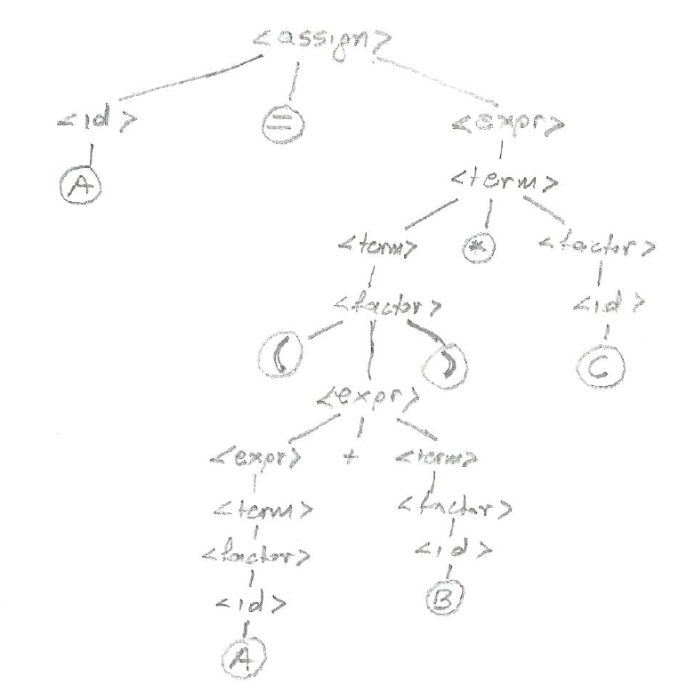
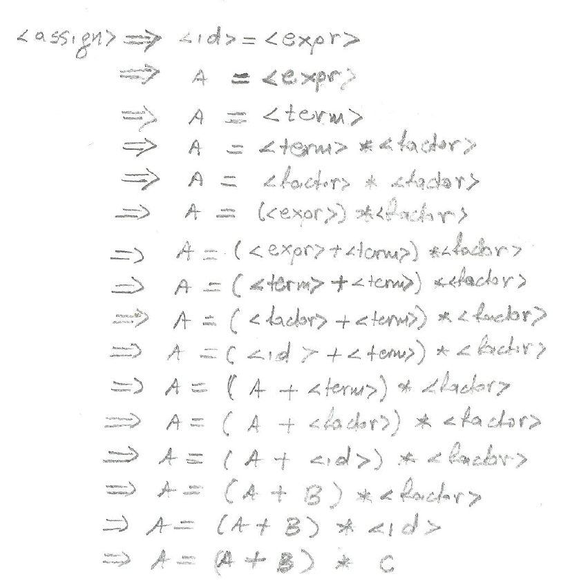
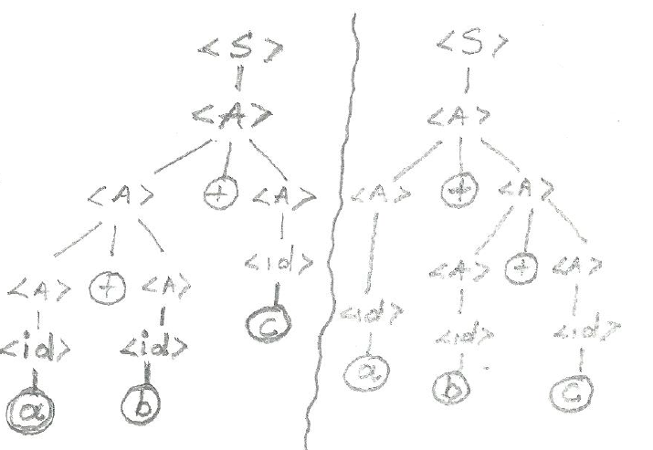
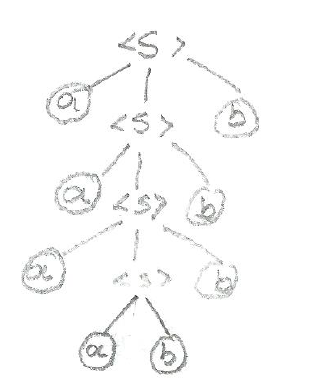

# Ασκήσεις από το βιβλίο "Αρχές Γλωσσών Προγραμματισμού 11η έκδοση R.W. Sebesta"

## Κεφάλαιο 3

### Άσκηση 7.Α

Χρησιμοποιώντας την ακόλουθη γραμματική:

```
<assign> -> <id> = <expr>
<id> -> A | B | C
<expr> -> <expr> + <term>
        | <term>
<term> -> <term> * <factor>
        | <factor>
<factor> -> ( <expr> )
            | <id>
```

δείξτε ένα δένδρο συντακτικής ανάλυσης και μια αριστερότερη παραγωγή για την πρόταση

```
A = (A + B) * C
```

**Λύση**





### Άσκηση 8

Αποδείξτε ότι η ακόλουθη γραμματική είναι ασαφής:

```
<S>  -> <A>
<A>  -> <A> + <A> | <id>
<id> -> a | b | c
```

**Λύση**




### Άσκηση 10

Περιγράψτε σε φυσική γλώσσα τη γλώσσα που ορίζει η παρακάτω γραμματική

```
<S> -> <A><B><C>
<A> -> a<A> | a
<B> -> b<B> | b
<C> -> c<C> | c
```

**Λύση**

Όλες οι συμβολοσειρές με ένα ή περισσότερα a που ακολουθούνται από ένα ή περισσότερα b που ακολουθούνται από ένα ή περισσότερα c.

### Άσκηση 11

Εξετάστε την παρακάτω γραμματική:

```
<S> -> <A>a<B>b
<A> -> <A>b | b
<B> -> a<B> | a
```

Ποιες από τις παρακάτω προτάσεις βρίσκονται στη γλώσσα που παράγει αυτή η γραμματική;

1. baab
2. bbbab
3. bbaaaaaS
4. bbaab

**Λύση**

Θα πρέπει να ξεκινά με έναν αριθμό από b, να ακολουθούν τουλάχιστον 2 a και να τελειώνει με b

1. baab (ΝΑΙ)
2. bbbab (ΟΧΙ, δεν έχει τουλάχιστον 2 a)
3. bbaaaaaS (ΟΧΙ τελειώνει σε S)
4. bbaab (NAI)

### Άσκηση 13 & Άσκηση 14

Γράψτε μια γραμματική για τη γλώσσα που αποτελείται από συμβολοσειρές οι οποίες έχουν n αντίγραφα του γράμματος a που ακολουθούνται από τον ίδιο αριθμό αντιγράφων του γράμματος b, όπου n>0. Για παράδειγμα οι συμβολοσειρές ab, aabb, aaabbb ανήκουν στη γλώσσα αλλά όχι οι a, abb, ba, aabbb.

Σχεδιάστε δένδρο συντακτικής ανάλυσης για την πρόταση aaaabbbb.

**Λύση**

```
<S> -> a<S>b | ab
```




### Άσκηση 16

Μετατρέψτε το ακόλουθο BNF σε EBNF.

```
<assign> -> <id> = <expr>
<id> -> A | B | C
<expr> -> <expr> + <expr>
        | <expr> * <expr>
        | ( <expr>)
        | <id>
```

**Λύση**
```
<assign> -> <id> = <expr>
<id> -> A | B | C
<expr> -> <expr> (+|*) <expr>
        | ( <expr>)
        | <id>
```

### Άσκηση 17

Μετατρέψτε το παρακάτω EBNF σε BNF:

```
S -> A{bA}
A -> a[b]A
```

**Λύση**

Χρήση αγκυλών {} υποδηλώνουν ότι το τμήμα που εσωκλείεται μπορεί να επαναλαμβάνεται απεριόριστα ή να αποκλειστεί εντελώς

Προαιρετικά τμήματα του RHS τοποθετούνται σε αγκύλες []

```
S -> A | AbS
A -> abA | aA
```

## Κεφάλαιο 4

### Άσκηση 1

Εκτελέστε τη δοκιμή ιδιότητας ξένων ανά ζεύγη για τους παρακάτω κανόνες γραμματικής.

```
α. A -> aB | b | cBB
β. B -> aB | bA | aBb
γ. C -> aaA | b | caB
```

<!-- **Λύση**

a. FIRST(aB) = {a}, FIRST(b) = {b}, FIRST(cBB) = {c} άρα **ισχύει** η ιδιότητα ξένων ανά ζεύγη
β. FIRST(aB) = {a}, FIRST(bA) = {b}, FIRST(aBb) = {a} άρα **δεν ισχύει** η ιδιότητα ξένων ανά ζεύγη
γ. FIRST(aaA) = {a}, FIRST(b) = {b}, FIRST(caB) = {c} άρα **ισχύει** η ιδιότητα ξένων ανά ζεύγη -->


### Άσκηση 3

Αποτυπώστε την πορεία του συντακτικού αναλυτή αναδρομικής κατάβασης της ενότητας 4.4.1 για τη συμβολοσειρά a + b * c

<!-- **Λύση**

```
O lexer επιστρέφει a
Enter <expr>
        Enter <term>
                Enter <factor>
                        O lexer επιστρέφει +
                Exit <factor>
        Exit <term>
        O lexer επιστρέφει b
        Enter <term>
                Enter <factor>
                        O lexer επιστρέφει *
                Exit <factor>
                O lexer επιστρέφει c
                Enter <factor>
                        O lexer επιστρέφει EOF
                Exit <factor>
        Exit <term>
Exit <expr>
``` -->

### Άσκηση 5

Αποτυπώστε την πορεία του συντακτικού αναλυτή αναδρομικής κατάβασης της ενότητας 4.4.1 για τη συμβολοσειρά a * (b + c)

<!-- **Λύση**

```
O lexer επιστρέφει a
Enter <expr>
        Enter <term>
                Enter <factor>
                        O lexer επιστρέφει *
                Exit <factor>
        O lexer επιστρέφει (
                Enter <factor>
                O lexer επιστρέφει b
                        Enter <expr>
                                Enter <term>
                                        Enter <factor>
                                                O lexer επιστρέφει +
                                        Exit <factor>
                                Exit <term>
                                O lexer επιστρέφει c
                                Enter <term>
                                        Enter <factor>
                                                O lexer επιστρέφει )
                                        Exit <factor>
                                Exit <term>
                        Exit <expr>
                O lexer επιστρέφει EOF
                Exit <factor>
        Exit <term>
Exit <expr>
``` -->