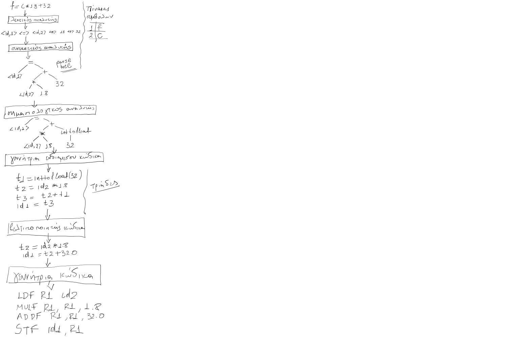

# Ασκήσεις 

## Άσκηση 1

Για την ακόλουθη γραμμή κώδικα ενός προγράμματος να σχεδιάσετε την είσοδο και την έξοδο κάθε φάσης μεταγλώττισης (λεκτική ανάλυση, συντακτική ανάλυση, σημασιολογική ανάλυση, γεννήτρια ενδιάμεσου κώδικα (σε τριάδες), βελτιστοποίηση κώδικα, γεννήτρια συμβολικού κώδικα). Θεωρείστε ότι οι μεταβλητές f και c είναι float. 

```
f = c * 1.8 + 32
```

Μπορείτε να χρησιμοποιήσετε τις ακόλουθες υποθετικές εντολές συμβολικής γλώσσας:

| Εντολή συμβολικής γλώσσας        | Περιγραφή                                                                                                                                                        |
| --------------- | ---------------------------------------------------------------------------------------------------------------------------------------------------------------- |
| LDF R1, A       | Φόρτωσε τον float αριθμό από τη θέση μνήμης στην οποία βρίσκεται η μεταβλητή Α στον καταχωρητή R1                                                                |
| STF A, R1       | Αποθήκευσε τον float αριθμό από τον καταχωρητή R1 στη θέση μνήμης στην οποία βρίσκεται η μεταβλητή Α                                                             |
| MULF R1, R2, R3 | Πολλαπλασίασε τα περιεχόμενα του καταχωρητή R2 με τα περιεχόμενα του καταχωρητή R3 και αποθήκευσε το αποτέλεσμα στον καταχωρητή R1 (πολλαπλασιασμός float τιμών) |
| ADDF R1, R2, R3 | Άθροισε τα περιεχόμενα του καταχωρητή R2 με τα περιεχόμενα του καταχωρητή R3 και αποθήκευσε το αποτέλεσμα στον καταχωρητή R1 (πρόσθεση float τιμών)              |

**Λύση**
<!--  -->


## Άσκηση 2

Έστω η ακόλουθη γραμματική:

```
<assign> -> <id> = <expr>
<id>     -> A | B | C
<expr>   -> <id> + <expr>
          | <id> * <expr>
          | ( <expr> )
          | <id>
```

Γράψτε την παραγωγή της πρότασης:

```
A = B * (A + C)
```

Σχεδιάστε το δένδρο συντακτικής ανάλυσης για την ίδια πρόταση.

**Λύση**

Η λύση της άσκησης βρίσκεται στο [Κεφάλαιο 3 - παράγραφοι 3.3.1.5 και 3.3.1.6](./../cpl_sebesta/ch03/index.md)


## Άσκηση 3

Έστω η γραμματική χαρακτηριστικών: 

```
1. Συντακτικός κανόνας: <assign> -> <var> = <expr>
    Σημασιολογικός κανόνας: <expr>.expected_type = <var>.actual_type

2. Συντακτικός κανόνας: <expr> -> <var>[2] + <var>[3]
    Σημασιολογικός κανόνας: <expr>.actual_type =
    if (<var>[2].actual_type = int_type) and (<var>[3].actual_type = int_type) then 
        int_type
    else 
        real_type
    end if
    Κατηγόρημα: <expr>.actual_type == <expr>.expected_type

3. Συντακτικός κανόνας: <expr> -> <var>
    Σημασιολογικός κανόνας: <expr>.actual_type = <var>.actual_type
    Κατηγόρημα: <expr>.actual_type == <expr>.expected_type

4. Συντακτικός κανόνας: <var> -> A | B | C 
    I. Συντακτικός κανόνας: <var> -> A
    Σημασιολογικός κανόνας: <var>.actual_type = look-up(A.value)
    
    II. Συντακτικός κανόνας: <var> -> B 
    Σημασιολογικός κανόνας: <var>.actual_type = look-up(B.value)
    
    III. Συντακτικός κανόνας: <var> ->  C
    Σημασιολογικός κανόνας: <var>.actual_type = look-up(C.value)
```

για την πρόταση:

```
Α = Α + Β
```

με A int_type και B real_type, σχεδιάστε το επισημειωμένο δένδρο συντακτικής ανάλυσης.


## Άσκηση 4

Δώστε τη λειτουργική σημασιολογία για την εντολή while της C.

```
while (expr)
{
    stmts
}
```

<!-- **Λύση**

```
loop: control = expr
    if control == 0 goto out
    stmts
    goto loop
out: ... -->
```