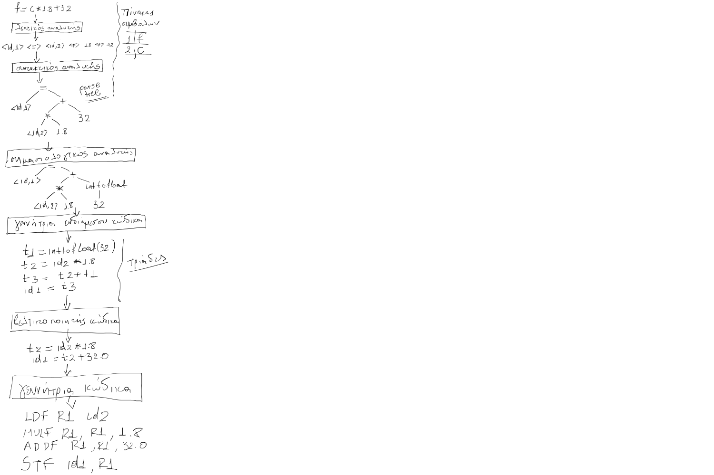

# Ασκήσεις 

## Άσκηση 1

Για την ακόλουθη γραμμή κώδικα ενός προγράμματος να σχεδιάσετε την είσοδο και την έξοδο κάθε φάσης μεταγλώττισης (λεκτική ανάλυση, συντακτική ανάλυση, σημασιολογική ανάλυση, γεννήτρια ενδιάμεσου κώδικα (σε τριάδες), βελτιστοποίηση κώδικα, γεννήτρια συμβολικού κώδικα). Θεωρείστε ότι οι μεταβλητές f και c είναι float. 

```
f = c * 1.8 + 32
```

Μπορείτε να χρησιμοποιήσετε τις ακόλουθες υποθετικές εντολές συμβολικής γλώσσας:

| <div style="width:150px">Εντολή</div> | Περιγραφή                                                                                                                                                        |
| ------------------------------------- | ---------------------------------------------------------------------------------------------------------------------------------------------------------------- |
| LDF R1, A                             | Φόρτωσε τον float αριθμό από τη θέση μνήμης στην οποία βρίσκεται η μεταβλητή Α στον καταχωρητή R1                                                                |
| STF A, R1                             | Αποθήκευσε τον float αριθμό από τον καταχωρητή R1 στη θέση μνήμης στην οποία βρίσκεται η μεταβλητή Α                                                             |
| MULF R1, R2, R3                       | Πολλαπλασίασε τα περιεχόμενα του καταχωρητή R2 με τα περιεχόμενα του καταχωρητή R3 και αποθήκευσε το αποτέλεσμα στον καταχωρητή R1 (πολλαπλασιασμός float τιμών) |
| ADDF R1, R2, R3                       | Άθροισε τα περιεχόμενα του καταχωρητή R2 με τα περιεχόμενα του καταχωρητή R3 και αποθήκευσε το αποτέλεσμα στον καταχωρητή R1 (πρόσθεση float τιμών)              |

**Λύση**
<!--  -->


## Άσκηση 2

Έστω η ακόλουθη γραμματική:

```
<assign> -> <id> = <expr>
<id>     -> A | B | C
<expr>   -> <id> + <expr>
          | <id> * <expr>
          | ( <expr> )
          | <id>
```

Γράψτε την παραγωγή της πρότασης:

```
A = B * (A + C)
```

Σχεδιάστε το δένδρο συντακτικής ανάλυσης για την ίδια πρόταση.

**Λύση**

Η λύση της άσκησης βρίσκεται στο [Κεφ.3 Περιγραφή Συντακτικού και Σημασιολογίας (Sebesta)](./../cpl_sebesta/ch03/index.md)