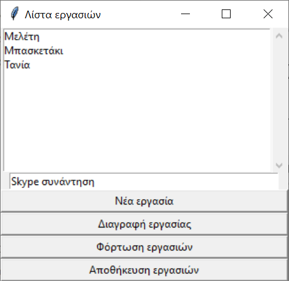

# Παραδείγματα με GUIs

## TkInter

### Παράδειγμα: TODO List με TKInter



* [todolist.py](./tkinter_todo/todolist.py)


<!-- ## PyQt

### Παράδειγμα: TODO List με PyQt

```
$ pip install PySide6
```

  * [todolist.py](./pyqt_todo/todolist.py)
  * [main.py](./pyqt_todo/main.py)
  * [todolist.txt](./pyqt_todo/todolist.txt)

## wxPython

### Παράδειγμα: TODO List με wxPython
 -->
