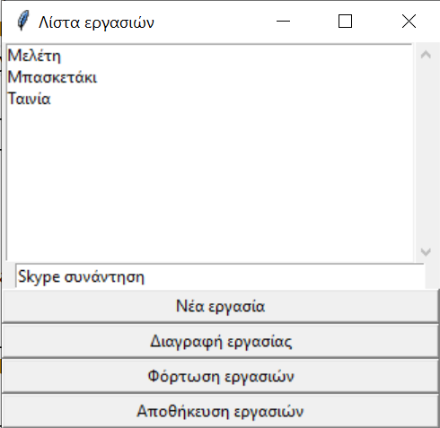
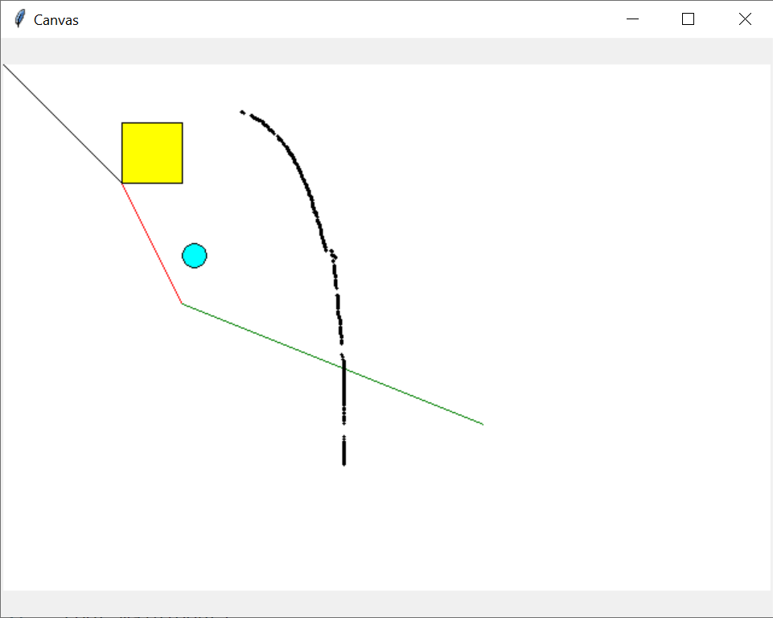
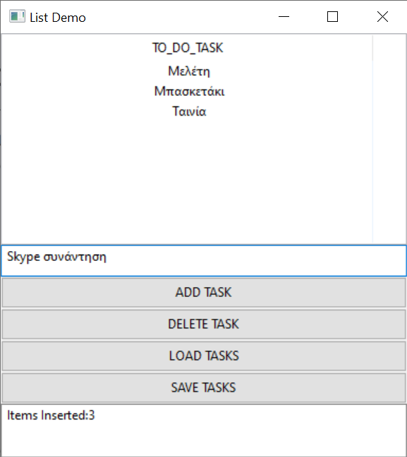

# Παραδείγματα με GUIs

## TkInter

### TODO List με TkInter



* [todolist.py](./tkinter_todo/todolist.py)
* [TokyoEdtech - YouTube](https://www.youtube.com/watch?v=8qUJ9a_3zSQ)

### Σχεδίαση σε canvas



* [canvas_shapes.py](./tkinter_canvas/canvas_shapes.py)

## wxPython

### TODO List με wxPython



* [todolist.py](./wxpython_todo/todolist.py)


<!-- ## PyQt

### Παράδειγμα: TODO List με PyQt

```
$ pip install PySide6
```

  * [todolist.py](./pyqt_todo/todolist.py)
  * [main.py](./pyqt_todo/main.py)
  * [todolist.txt](./pyqt_todo/todolist.txt)

 -->
